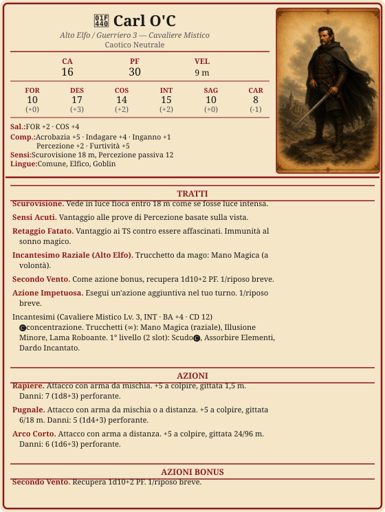

# Carl O'C

> **Descrizione**
> Alto Elfo esiliato da Larethil. Ladro e spia che ha risvegliato poteri arcani diventando un Cavaliere Mistico.

> **Fisico**
> 190 cm, 85 kg. Capelli castani, occhi castani, carnagione chiara. 135 anni.

> **Caratteriale**
> Enigmatico, furbo, manipolatore, individualista.
> Prima la sua pelle, poi quella degli altri.

> **Ideali**
> *"Ruba ai ricchi, non ai poveri."* Tornare a Larethil da eroe smascherando il governo corrotto.

> **Difetti**
> Individualista — quando le cose si mettono male, pensa prima a se stesso.

> **Privilegio** — Contatto Criminale
> Ha un contatto affidabile: tramite con una fitta rete criminale. Messaggi a grandi distanze tramite corrieri, carovanieri e marinai poco raccomandabili.

---

---

## Riposi

- [ ] Riposo breve
- [ ] Riposo breve
- [ ] Riposo lungo

---

## Risorse

### Secondo Vento
*1/riposo breve*
- [ ] ◆

### Azione Impetuosa
*1/riposo breve*
- [ ] ◆

### Slot 1°
*2/riposo lungo*
- [ ] I
- [ ] I

---

## Equipaggiamento

| mr | ma | mo | mp | me |
| --- | --- | --- | --- | --- |
| 0 | 4 | 144 | 0 | 0 |

| Oggetto | Peso | Note |
| ------------------- | ------ | ---------------- |
| Rapiere | 1 kg | accurata |
| Pugnali (x2) | 1 kg | lancio, accurata |
| Arco Corto | 1 kg | |
| Faretra + 20 frecce | 0,5 kg | |
| Armatura di cuoio | 7,5 kg | CA 11+DES |
| Scudo | 3 kg | CA +2 |
| Attrezzi da scasso | 1 kg | |
| Dadi | — | |
| Mantello scuro | — | |
| Gesso | — | |
| Fune (15 m) | 5 kg | |
| Libro di alchimia | 1 kg | tesoro |
| **Totale** | | |

---

## Narrativa

### Storia
Carl O'Crack è un alto elfo esiliato dalla sua terra natale Larethil dopo aver scoperto una rete di corruzione che coinvolgeva membri influenti della sua comunità.

Nel mondo degli umani ha sopravvissuto come ladro, informatore, spia e spadaccino, muovendosi tra vicoli e taverne come un'ombra. Durante una fuga, si è rifugiato in antiche rovine arcane dove ha risvegliato un potere latente: unisce tecnica di spada e magia, diventando un Cavaliere Mistico.

Ora vive come fuorilegge, opera nell'ombra, aiutando di tanto in tanto qualcuno in difficoltà. 

Il suo sogno è ritornare a Larethil da eroe, denunciando o sgominando il giro di corruzione intorno ai membri che lo hanno esiliato.

### Alleati

### Legami

Tornare a Larethil da eroe smascherando il governo corrotto.

### Nemici 

Governo corrotto di Larethil.

### Note di gioco

- Ha truffato passeggeri rivendendo biglietti del treno a Suzail (A2S6).
- Ha inviato una missiva a per info sulle sigle del pizzino (A3S13).
- Nel sogno del 1900 DR era Brann.
