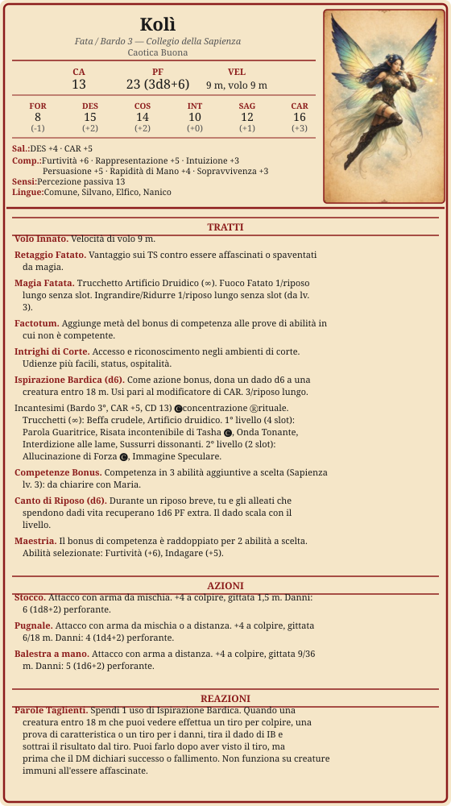

# Kolìthae

> **Descrizione**
> «Colei che vibra tra le pieghe del tempo»
> Fata della Corte Seelie, barda cortigiana dalle ali simili a quelle di un colibrì. Vaga per onorare un amore perduto e una promessa fatta al tempo stesso.

> **Fisico**
> 88 cm, 14 kg. Ali da colibrì. Occhi gialli aranciati, carnagione chiara, capelli blu di persia.

> **Caratteriale**
> Vive le emozioni in maniera estrema. Vive di simboli, gesti e rituali. Curiosa verso il concetto di tempo lineare e spazio definito.
> Tiene molto al suo titolo e onora sempre le promesse.

> **Ideali**
> *"Onorare i legami con armonia genera la meraviglia necessaria a piegare la realtà."*

> **Difetti**
> Prende tutto sul personale. Il ferro lavorato le è disturbante.

> **Privilegio** — Funzionario di Corte
> Negli ambienti di corte — mortali o fatati — il suo titolo apre porte che ad altri restano chiuse. Ottiene udienza da nobili, diplomatici e spiriti di rango; le viene offerta ospitalità in cambio di notizie dalla Corte Seelie. Chi conosce le Fate sa che ogni favore ha un prezzo.

---

---

## Riposi

- [ ] Riposo breve
- [ ] Riposo breve
- [ ] Riposo lungo

---

## Risorse
### Slot 1°
*4/riposo lungo*
- [x] I
- [ ] I
- [ ] I
- [ ] I

### Slot 2°
*2/riposo lungo*
- [ ] II
- [ ] II

### Ispirazione Bardica
*3/riposo lungo*
- [ ] 1d6
- [ ] 1d6
- [ ] 1d6

---

## Equipaggiamento

| mr | ma | mo | mp | me |
| --- | --- | --- | --- | --- |
| 7 | 6 | 30 | 0 | 0 |

| Oggetto | Peso | Valore | Note |
| ----------------------- | ----------- | ------ | ----------------------------------- |
| Armatura di cuoio | 5 kg | 10 mo | leggera |
| Stocco | 1 kg | 25 mo | accurata |
| Pugnale | 0,5 kg | 2 mo | lancio, accurata |
| Balestra a mano | 1,5 kg | 75 mo | |
| Quadrelli (20) | 0,75 kg | 1 mo | |
| Flauto di selenite | 0,5 kg | 20 mo | bacchetta di selenite di Aerin Mess |
| Zaino | 2,5 kg | 2 mo | |
| Borsa da cortigiana | 0,5 kg | 1 mo | accessorio elegante |
| Anello con opale bianco | — | 30 mo | gioiello personale |
| **Totale** | **10,5 kg** | | trasporto leggero (soglia: 20 kg) |

---

## Narrativa

### Alleati
- Corte Seelie · Regina Titania
- Reti di contatti negli ambienti di corte (privilegio Cortigiana)

### Legami
- Il flauto di selenite è stato ricavato da una bacchetta appartenuta ad Aerin Mess.
- Il legame con Aerin è per lei indissolubile, oltre ogni dimensione conosciuta.

### Nemici
-

### Note di gioco
- Ha mostrato una natura sadica durante l'interrogatorio di Tommy Hale (A3S12) — evento che l'ha turbata.
- È partita in solitaria per Hardbuckler (A3S13), dove ha incontrato la maga Nela Inchtarwurn.
- Nel sogno condiviso del 1900 DR era Aerin Mess.
