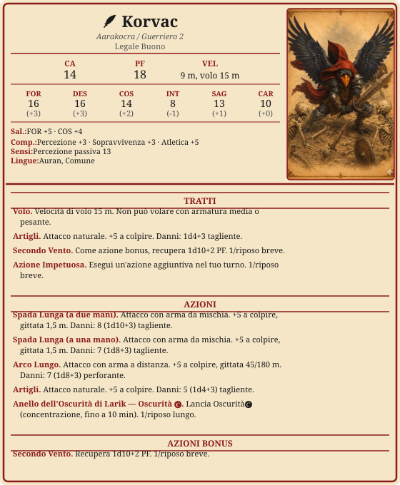

# Korvac

> **Descrizione**
> Aarakocra guerriero e forestiero. Cacciatore disciplinato segnato dalla distruzione del suo villaggio. Ossessionato dai non morti.

> **Fisico**
> 175 cm, 65 kg. Piume grigio scure con riflessi neri su ali e cresta. Occhi giallo ambra. 24 anni.

> **Caratteriale**
> Osserva prima di parlare. Disciplinato e metodico nella caccia.
> Non ama gli spazi chiusi ma non lo dà a vedere.

> **Ideali**
> *"Ciò che è morto non merita di camminare tra noi."*

> **Difetti**
> Si espone facilmente al pericolo pur di eliminare creature non-morte — anche a rischio della propria vita.
> Fatica a dormire in luoghi chiusi o sotterranei, ma non lo dà a vedere.

> **Privilegio** — Viandante
> Memoria geografica infallibile. Sa trovare cibo e acqua fresca per sé e fino a 5 persone ogni giorno, a patto che il territorio offra risorse naturali.

---

---

## Riposi

- [ ] Riposo breve
- [ ] Riposo breve
- [ ] Riposo lungo

---

## Risorse

### Secondo Vento
*1/riposo breve*
- [ ] ◆

### Azione Impetuosa
*1/riposo breve*
- [ ] ◆

### Anello dell'Oscurità di Larik — Oscurità 🅒
*1/riposo lungo*
- [ ] ◆

---

## Equipaggiamento

| mr | ma | mo | mp | me |
| --- | --- | --- | --- | --- |
| 0 | 0 | 100 | 0 | 0 |

| Oggetto | Peso | Valore | Note |
| --------------------------------- | ------- | ------- | --------------------------------------- |
| Armatura di cuoio | 5 kg | 10 mo | armatura leggera, AC 11+DES |
| Spada lunga | 1,5 kg | 15 mo | versatile |
| Arco lungo | 1 kg | 50 mo | |
| Faretra + 20 frecce | 0,5 kg | 1 mo | |
| Coltello | 0,5 kg | 2 mo | lancio, accurata |
| Anello dell'Oscurità di Larik | — | — | oggetto magico |
| Anello di Alexi | — | — | tesoro |
| Pozione di guarigione | 0,25 kg | 50 mo | 2d4+2 PF |
| Veleno base | — | 100 mo | 1d4 veleno, CD 10 Cos; 1 azione applicare |
| **Totale** | **8,75 kg** | | trasporto leggero (soglia: 23 kg) |

---

## Narrativa

### Storia
Il villaggio di Korvac è stato distrutto dai non morti. Da quel giorno porta sempre con sé una piuma bruciata trovata sul luogo della strage — l'unico frammento rimasto della sua gente. Ha fatto un giuramento al suo mentore, un debito che non ha ancora onorato. Ora cammina tra i mortali come cacciatore: disciplinato, metodico, con gli occhi fissi su qualunque cosa non meriti di stare in piedi.

### Alleati
-

### Legami
- Porta sempre con sé una piuma bruciata trovata sul luogo della strage del suo villaggio.
- Il mentore verso cui ha un giuramento in sospeso.

### Nemici
- Un necromante ancora in vita che ha guidato l'attacco al suo villaggio.

### Note di gioco
- Nel sogno del 1900 DR era Torfin.
- Sesto senso: ha centrato Larik Doss con una freccia scoccata nell'oscurità più profonda.
- Piumacce dure: sconfitto da Tommy Hale, resta sospeso tra la vita e la morte. Ne esce vivo.
