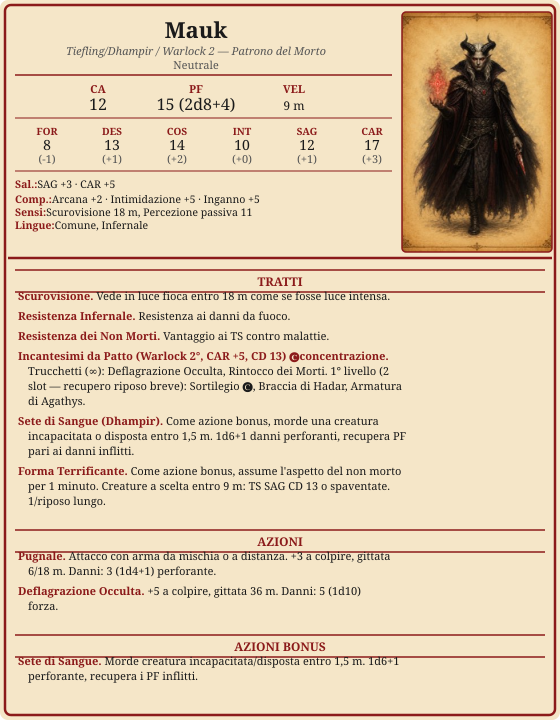

# Mauk

> **Descrizione**
> Tiefling trasformato in Dhampir da un rituale di selezione. Il legame warlock oscuro e silenzioso è Kas il Sanguinario che lo osserva da Tovag.

> **Fisico**
> 188 cm, 84 kg. Carnagione pallida, capelli cenere, occhi rossi. 92 anni.

> **Caratteriale**
> Pianifica ogni dettaglio perché l'errore costa vite.
> Tratta il sangue come un reagente, non come cibo.
> Non riesce a lasciare un rituale incompleto.
> Fame del Dhampir: si nutre di sogni.

> **Ideali**
> Vuole scoprire perché è stato creato e da chi.

> **Difetti**
> Il legame con Kas è ignoto a lui — è uno dei candidati a diventare il corpo recipiente del vampiro. Ha lottato con la sete di sangue.

> **Privilegio** — Cuore di Tenebra
> Chi incontra il suo sguardo riconosce che ha affrontato l'orrore. Le persone comuni sono disposte ad aiutarlo — rifugio, informazioni, alleanza contro una minaccia comune.

---

---

## Riposi

- [ ] Riposo breve
- [ ] Riposo breve
- [ ] Riposo lungo

---

## Risorse

### Slot Patto
*2/riposo breve*
- [ ] I
- [ ] I

### Forma Terrificante
*2/riposo lungo*
- [ ] ◆
- [ ] ◆

---

## Equipaggiamento

| mr | ma | mo | mp | me |
|---|---|---|---|---|
| 0 | 0 | 0 | 0 | 0 |

| Oggetto | Peso | Note |
| ------------------------------------------ | :----- | ----------------------------------------------------------------- |
| Armatura di cuoio | 5 kg | |
| Pugnale ×2 | 1 kg | |
| Focus arcano | — | Talismà rituale inciso |
| Registri di spedizione (Tommy Hale) ×3 | 7,5 kg | trovati nell'ufficio (A3S13) — corrispondenza con Aris Thorne |
| Piede di porco | 2,5 kg | |
| Martello | 1 kg | |
| Paletti di legno ×3 | 2 kg | |
| Simbolo sacro | — | |
| Manette d'acciaio | — | |
| Specchio d'acciaio | 0,5 kg | |
| Ampolla di acquasanta | — | |
| Ampolla vuota | — | |
| **Totale** | ~20 kg | |

---

## Narrativa

### Alleati
-

### Legami
-

### Nemici
- Kas il Sanguinario — suo patrono inconsapevole, lo osserva da Tovag.

### Flashback — Il Sigillo del Sangue

La stanza era buia, illuminata solo da candele nere disposte in un cerchio perfetto. L'aria era fredda, e l'odore ferroso del sangue riempiva ogni angolo. Mauk, ancora giovane, tiefling ma già diverso dagli altri, si inginocchiò al centro del cerchio.

Davanti a lui, un antico tomo giaceva aperto: glifi e simboli che promettevano potere, conoscenza e non morte. La setta che lo aveva portato lì non parlava del prezzo, solo delle istruzioni. Mauk seguì ogni linea, ogni incisione, ogni goccia di sangue caduta sul pavimento: precisione sopra ogni cosa.

### Note di gioco
- Nel sogno del 1900 DR era Belin.
- Ha lottato con la sete di sangue (A3S8, A3S11).
- Harlan gli ha dato un pugno (A3S15) — questione biglietti treno da Suzail.

## Link a scheda PDF

https://drive.google.com/file/d/1kU-eJ_UGBLPEGuLbGLruEJUTV0YnfXkc/view?usp=drive_link
