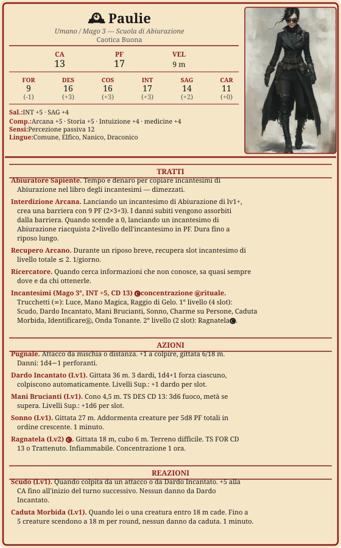

# Paulie Locke

> **Descrizione**
> Maga umana e abiuratrice. Porta al collo un orologio d'argento con incisa la scritta *Deus ex machina* — il confine tra il suo passato in fabbrica e il risveglio ai poteri arcani.

> **Fisico**
> 30 anni, 1,65 m, 60 kg. Occhi verdi, carnagione chiara, capelli neri.

> **Caratteriale**
> Curiosa, riservata, poco loquace, entusiasta per le cose nuove.

> **Ideali**
> *"Crede nel far bene e che questo possa portare al cambiamento."*

> **Difetti**
> Non parla molto in generale — a primo impatto risulta difficile da avvicinare.

> **Privilegio** — Ricercatore
> Sa sempre dove cercare — archivi accademici, studiosi ai margini, custodi di saperi dimenticati. Chiunque abbia risposto a domande simili prima di lei, sa come trovarlo. Più la domanda è scomoda, più la risposta è nascosta.

---

---

## Incantesimi

**Caratteristica:** INT | **CD:** 13 | **Bonus attacco:** +5
**Prepara:** 6 incantesimi/giorno (INT mod 3 + livello 3)

### Trucchetti
- Luce
- Mano Magica
- Raggio di Gelo

### 1° livello
*seleziona 6 oggi*
- [ ] Scudo
- [ ] Dardo Incantato
- [ ] Mani Brucianti
- [ ] Sonno
- [ ] Charme su Persone
- [ ] Caduta Morbida
- [ ] Identificare Ⓡ
- [ ] Onda Tonante

### 2° livello
- [ ] Ragnatela 🅒

---

## Riposi

- [ ] Riposo breve
- [ ] Riposo breve
- [ ] Riposo lungo

---

## Risorse

### Interdizione Arcana
1. *Usa un incantesimo di abiurazione*
2. *PF Interdizione = 2 × Lv. Mago + INT*
3. *Ricarica = 2 x lv. incantesimo*

| PF Interdizione Arcana | |
| :--------------------: | :-: |

### Recupero Arcano
*1/giorno*
- [ ] ◆

### Slot 1°
*4/riposo lungo*
- [ ] I
- [ ] I
- [ ] I
- [ ] I

### Slot 2°
*2/riposo lungo*
- [ ] II
- [ ] II

---

## Equipaggiamento

| mr | ma | mo | mp | me |
| -- | -- | -- | -- | -- |
| | | 160 | | |

| Oggetto | Peso | Note |
| --- | --- | --- |
| Pugnale | 0,5 kg | 1d4 P, gittata 6/18 m |
| Orologio da taschino | — | *Deus ex machina* — fuoco arcano |
| Libro Incantesimi | 1,5 kg | |
| Libro di studio | 2,5 kg | |
| Boccetta d'inchiostro + pennino | — | |
| 10 fogli di pergamena | — | |
| Sacchetto di sabbia | 0,5 kg | |
| Coltellino | — | |
| Tenda | 9 kg | |
| Torcia | 0,5 kg | |
| Giaciglio | 3,5 kg | |
| 10 razioni | 5 kg | |
| Borraccia | 2,5 kg | |
| **Totale** | **~25,5 kg** | |

---

## Caratteristiche

| Punteggi | | Tiri Salvezza | |
| --- | --- | --- | --- |
| Forza | 9 (−1) | Forza | −1 |
| Destrezza | 16 (+3) | Destrezza | +3 |
| Costituzione | 16 (+3) | Costituzione | +3 |
| Intelligenza | 17 (+3) | Intelligenza | +5 ● |
| Saggezza | 14 (+2) | Saggezza | +4 ● |
| Carisma | 11 (0) | Carisma | 0 |

**CA** 13 · **PF** 17 · **Velocità** 9 m · **Bonus Competenza** +2 · **Iniziativa** +3

**Competenze armi:** balestre leggere, bastoni ferrati, dardi, fionde, pugnali

---

## Narrativa

### Alleati
- Constance Locke — madre
- Jason — amico di famiglia, figura paterna

### Legami
- Cerca le risposte su cosa sia successo nella stanza della fabbrica e chi fosse l'uomo nelle visioni.
- Sente che il mistero della stanza sia collegato al segreto di Constance sul padre mai conosciuto.

### Nemici
-

### Note di gioco
- Nella prima sessione "Lo specchio e la nebbia era 🌫️ Aerin Mess, che ha assistito alla morte di sua madre.
- Nel sogno c'era un uomo con lo stesso sguardo dell'uomo nelle visioni della stanza della fabbrica.

### Background

*"Cos'è dunque il tempo? Se nessuno me lo chiede, lo so; se voglio spiegarlo a qualcuno che me lo chiede, non lo so più."*

**Infanzia.** Paulie è cresciuta con sua madre Constance — solo loro due. Bambina allegra e curiosa, trovò una figura paterna nell'amico di famiglia Jason. Il segreto di Constance sul padre di Paulie è sempre rimasto taciuto, nonostante i litigi: un'ossessione repressa che Paulie non ha mai smesso di portarsi dentro.

**La fabbrica.** Constance portava spesso la figlia con sé al lavoro. Paulie passava il tempo ad esplorare corridoi e reparti, diventando una presenza quasi invisibile tra le macchine.

**La stanza.** A otto anni, Paulie trovò una porta normalmente chiusa socchiusa. Scese una rampa di scale interminabile e aprì un'altra porta. Una luce azzurrina la investì e centinaia di immagini le scorsero attorno — battaglie, esplosioni, banchetti, morte. Una rimase impressa: un uomo sulla trentina, in divisa, che la guardava fisso negli occhi. Una voce disse *"Deus ex machina"* e Paulie si ritrovò fuori, con in mano un orologio da taschino argentato — usurato, funzionante, con quelle stesse parole incise all'interno.

**Il risveglio.** Tornata a casa, Paulie rimase in silenzio per giorni. Poi, a cena, mormorò *"Deus ex machina"* e una luce azzurrina si diffuse dall'orologio — gli oggetti cominciarono a fluttuare. Constance riconobbe quella manifestazione: l'aveva già vista anni prima, da qualcun altro.

**L'Accademia.** Constance rintracciò Rupert Finnes, che confermò: erano poteri magici, trasmessi da un'entità soprannaturale. Consigliò l'Accademia di Magia della capitale. Paulie ci andò, a malincuore — e finì per amarlo. Studiò con entusiasmo, ma non smise mai di cercare risposte sulla stanza: ricollegò le visioni a una guerra di circa cento anni prima.

**La ricerca.** Diplomata a 30 anni con ottimi voti, Paulie partì. Le risposte che cercava — chi era l'uomo nelle visioni, cosa fosse quella voce — non erano nell'Accademia. Sente che il mistero della stanza e il segreto di Constance sul padre siano, in qualche modo, la stessa cosa.

## Link a scheda PDF

https://drive.google.com/file/d/1_qfq7FzmxMgIxXVigfa9vcaIkxB_o4mJ/view?usp=drive_link
