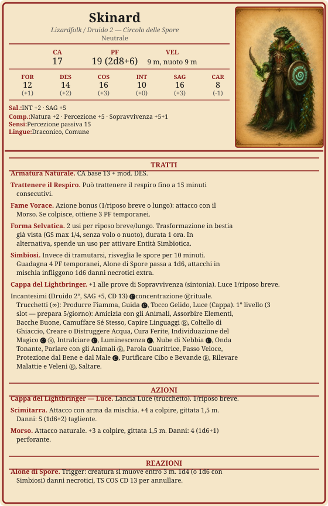

# Skinard

> **Descrizione**
> Lizardfolk druido del Circolo delle Spore. Osserva i "sangue caldo" con curiosità scientifica. Mandato dal suo circolo a studiare queste terre.

> **Fisico**
> 180 cm, 80 kg. Scaglie verdi, occhi gialli, cresta dorsale. 35 anni.

> **Caratteriale**
> Osserva prima di parlare. Metodico e paziente.
> Curiosità scientifica verso i sangue caldo — studia i loro schemi senza capirne le emozioni.

> **Ideali**
> *"Chi cade è perduto."* Il dovere verso il circolo viene prima di tutto.

> **Difetti**
> Dimentica spesso che le altre razze si offendono se mangia i resti dei nemici caduti.

> **Privilegio**  —  Sguardo Perspicace
> La sua stranezza culturale attira studiosi e naturalisti curiosi. Può ottenere udienza dove un avventuriero comune non riuscirebbe.

---

---

## Incantesimi

**Caratteristica:** SAG | **CD:** 13 | **Bonus attacco:** +5
**Prepara:** 5 incantesimi/giorno (SAG mod 3 + livello 2)

### Trucchetti
- Produrre Fiamma
- Guida 🅒
- Tocco Gelido
- Luce *(dalla Cappa del Lightbringer, 1/riposo breve)*

### 1° livello
*seleziona 5 oggi*
- [x] Amicizia con gli Animali
- [x] Assorbire Elementi
- [x] Bacche Buone
> **N.B.**
> - [x] Camuffare Sé Stesso
> - [x] Capire Linguaggi Ⓡ
- [ ] Coltello di Ghiaccio
- [x] Creare o Distruggere Acqua
- [ ] Cura Ferite
- [ ] Individuazione del Magico 🅒 Ⓡ
- [ ] Intralciare 🅒
- [x] Luminescenza 🅒
- [x] Nube di Nebbia 🅒
- [x] Onda Tonante
- [x] Parlare con gli Animali Ⓡ
- [x] Parola Guaritrice
- [x] Passo Veloce
- [x] Protezione dal Bene e dal Male 🅒
- [x] Purificare Cibo e Bevande Ⓡ
- [x] Rilevare Malattie e Veleni Ⓡ
- [x] Saltare

---

## Riposi

- [ ] Riposo breve
- [ ] Riposo breve
- [ ] Riposo lungo

---

## Risorse
### Cappa del Lightbringer — Luce
*1/riposo breve*
- [ ] ◆

### Forma Selvatica / Simbiosi
*2/riposo breve*
- [x] ◆
- [x] ◆

### Slot 1°
*3/riposo lungo*
- [ ] I
- [ ] I
- [ ] I

---

## Equipaggiamento

| mr  | ma  | mo  | mp  | me  |
| --- | --- | --- | --- | --- |
| 0   | 0   | 110 | 0   | 0   |

| Oggetto          | Peso   | Valore | Note |
| ---------------- | ------ | ------ | ---- |
| Scimitarra       | 1,5 kg |        |      |
| Scudo            | 3 kg   |        |      |
| scrigno oscuro   |        |        |      |
| **Totale**       |        |        |      |
| scrigno          |        |        |      |
| razioni 19       |        |        |      |
| sacco a pelo     |        |        |      |
| gavetta          |        |        |      |
| pietra fpcai acc |        |        |      |
| otre             |        |        |      |
| corda            |        |        |      |
| zaino            |        |        |      |
| torce 10         |        |        |      |

---

## Narrativa

### Alleati
- Circolo delle Spore
- Circolo druidico Lizardfolk

### Legami
- Il circolo lo aspetta: tornare con conoscenze è il suo obbligo.

### Nemici
-

### Note di gioco
- Ha divorato un lupo durante A3S7.
- Ha avuto una visione Echo guardando Sirio negli occhi: Alexi contro i sicari.
- Ha mostrato i denti a Padre Merriksonn durante l'interrogatorio di Tommy (A3S12).
- Nel sogno del 1900 DR era Elenya.
