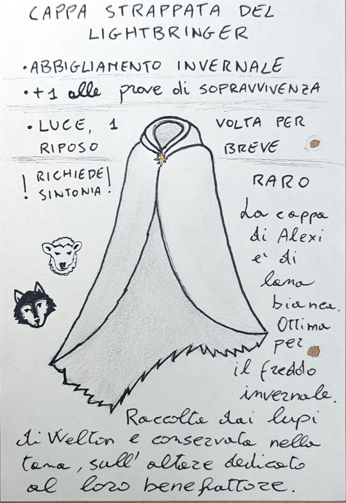

# Cappa Strappata del Lightbringer

*Bianca come la neve fresca — e come lei, non rimane dove l'hanno posata.*

## Descrizione

Equipaggiamento raro, richiede sintonia.

Pesante cappa di lana bianca, strappata lungo il fianco sinistro — il bordo pende asimmetrico, come se l'avessero afferrata di forza. Appartenuta ad Alexi Merriksonn, protettore di Welton. Indossata durante le sue ronde nel Bosco Occidentale, divenne il segno con cui i pastori lo riconoscevano anche da lontano. Dopo la sua scomparsa, fu raccolta dai lupi senzienti che lo veneravano come portatore di luce e portata nella loro tana, sull'altare dedicato al loro benefattore.

**Benefici.** Chi la indossa ottiene +1 alle prove di sopravvivenza.

**Uso dell'Oggetto.** Una volta per riposo breve, chi la indossa può lanciare Luce (trucchetto).

## Scheda

| Campo | Valore |
|---|---|
| Tipo | mantello |
| Peso | 2 |
| Costo | inestimabile |
| Reperibilità | unico |
| Richiede sintonia | ✓ |
| Effetti | Luce (1/riposo breve), +1 Sopravvivenza |

## Note

Trovata nella tana dei lupi di Welton, sull'altare dedicato ad Alexi Merriksonn.
