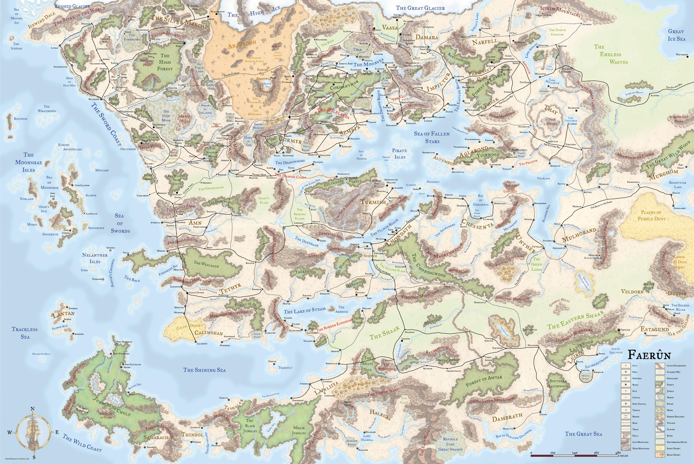

# Faerûn

Continente centrale di Toril, tra il Mare delle Spade a ovest e le terre di Kara-Tur a est. Dominato da regni umani, città-stato e confederazioni rurali, con enclave naniche ed elfiche sparse. Al centro si estende il Mare delle Stelle Cadute, che facilita i commerci tra le nazioni centrali.

---

## Grandi regioni

| Regione | Comprende |
|---|---|
| Costa della Spada e il Nord | Neverwinter, Waterdeep, Baldur's Gate, Frontiera Selvaggia |
| Terre Centrali *(Heartlands)* | Cormyr, Valli, Mare della Luna, Sembia |
| Terre dell'Intrigo | Amn, Calimshan, Tethyr |
| Antichi Imperi | Mulhorand, Chessenta, Unther |
| Terre Fredde | Damara, Narfell, Vaasa, Sossal |
| Terre del Sud | Chult, Halruaa, Dambrath |

---

## Storia in sintesi

- **~30.000 anni fa** — I Giorni del Tuono: civiltà rettiliane crollano, nasce l'era degli elfi e dei nani.
- **~5.000 anni fa** — Ascesa e caduta di **Netheril**: impero umano di città volanti, distrutto quando Karsus tentò di usurpare il potere di Mystra.
- **1358 CV** — Periodo dei Disordini: gli dèi camminano sulla terra, la magia diventa instabile.
- **1385 CV** — Piaga della Trama: Cyric uccide Mystra, la Trama si spezza, fuoco blu rimodella Faerûn.
- **1482–1487 CV** — Seconda Separazione: Toril e Abeir si dividono, la Trama è ripristinata, Mystra torna.
- **Oggi (~1489+ CV)** — Era di rinascita. Città-stato stabili, ma minacce antiche incombono.
