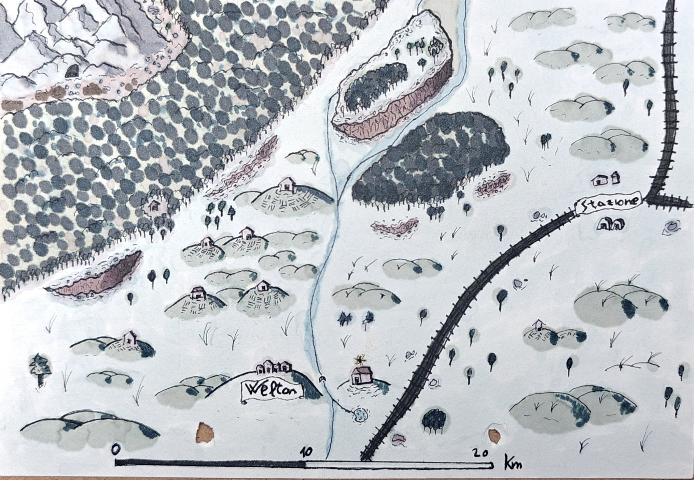

# Welton

*Dalle pagine di Volothamp Geddarm — un ritratto di chi guardava da lontano.*

---

## Volo, Welton

*Miei impavidi compagni di locanda, qui il vostro Volo, che ha attraversato abbastanza insediamenti tra la Costa della Spada da riconoscere un villaggio che regge per forza di volontà piuttosto che per forza propria. Da dove mi trovo, Welton ha l'aria di un posto che vuole restare quello che è, mentre il resto del mondo ha già deciso diversamente.*

---

### I. Il bianco e il fango

Welton sorge sulle rive di un fiume lento, con dolci colline su entrambi i lati. Le case sono di quercia, dipinte di bianco acceso, con intagli elaborati sotto le gronde, la cura di chi ci tiene all'aspetto anche quando i tempi sono difficili. La stragrande maggioranza della gente è umana, con una consistente minoranza di halfling e una manciata di nani, tra cui la famiglia Slatebeard, che gestisce il Bastone del Pastore e tiene insieme la comunità da decenni.

Nel 2026 DR le strade sterrate sono ridotte a pantani fangosi dal troppo traffico. C'è più gente in giro del solito, e molta di quella gente ha i bordi che stringono, come chi conta le settimane a voce bassa.

Il villaggio vive di grano e lana. Ha 130 anni. Ne porta forse ottanta nell'aspetto, ma il resto sta nelle spalle di chi l'abita e nel modo in cui regge le crisi senza spezzarsi del tutto.

---

### II. Ciò che i boschi nascondevano

A ovest ci sono i boschi, e nei boschi c'era la tana. Non di un predatore ordinario, di un branco che parla, discute, decide. Un branco di lupi senzienti, nati da un'esplosione di Magia Selvaggia quando Alexi Merriksonn, lo stregone protettore del villaggio, fu attaccato da sicari e scomparve. Lampo, la calma e il fulmine. Fiamma, la furia e il fuoco. Sirio, la curiosità che nessuno aveva previsto.

I lupi senzienti! Mordenkainen avrebbe scritto un intero capitolo di tabelle sul fenomeno. Io li ho visti da dove mi trovo e vi dico solo che il risultato finale è un accordo, non una testa sul palo: una pecora a settimana, stop agli attacchi, Padre Merriksonn garante. Non è un finale che si insegna nelle accademie militari, ma funziona.

---

### III. Ciò che rimane in sospeso

Alexi Merriksonn non è morto. È da qualche parte che non è qui, accessibile forse attraverso le nebbie di Tārabulus, e questa è una questione aperta che il villaggio non ha ancora avuto il tempo di elaborare. Tillus Merrion, l'halfling che reggeva il consiglio a colpi di contratti e pragmatismo, ha perso la sua certezza da uomo d'affari da quando ha scoperto che le due spie in paese lavoravano sotto di lui senza che lui lo sapesse. Adesso ascolta più di quanto parla, il che per Tillus è già una forma di rivoluzione.

Da dove mi trovo vedo i fili che ancora pendono su questo villaggio: Aris Thorne che aspetta il momento burocratico giusto, K.C. che non si è ancora fatto vedere di persona, la stazione e i suoi capannoni che restano un obiettivo per chiunque voglia controllare cosa passa e cosa non passa per questa parte del Faerun.

Welton resiste. Non per eroismo, ma per quella testardaggine silenziosa che è più difficile da sradicare del coraggio.

---

**Volothamp Geddarm**,
*Da dove il bianco arriva ma il fango no, 2026 DR.*
