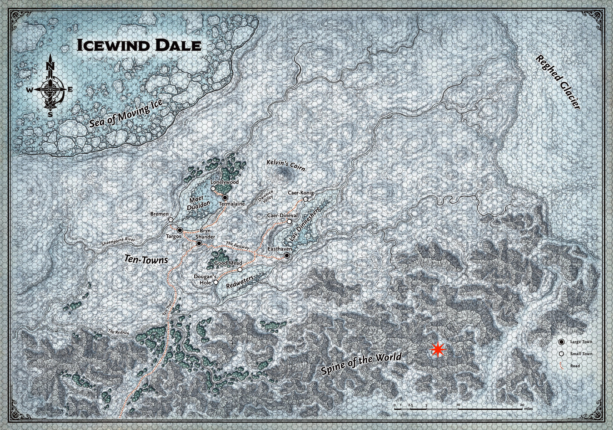

# Risposta Cifrata di Naaz

Quello che segue è arrivato cifrato, come sempre quando le informazioni scottano. La chiave, se esiste, tocca a voi trovarla.

Pz mqlvoqw... no, aspettate — questa non è la lettera che avete scritto. È la risposta.

S.N. p I.M wwwzpmjxyw hadpzx sm vqrwm wp lxm aphsp ouwddq. Eh xuqxl Skpf Fppxjkft swecmuim hadpzx bvr xdpcwvvluz oq nu ndvleqvv lhowt Halvwictu x zm fwdì ywg mwvap dqzuqiqnsmkljem nsm eh ndutrtbh Kkmxmzrs è iqkzci tst'rxpci. E'htwzl dqzsi pq ql ahzxhbelzx jph tl wwkv zhbp oq ivbhzp dq lpi dtwlzzhbd iww'qgamuvz omesm vbcfbmbzh ozgmkuiwqgp. Ikpa Wpzcv, ybvcqzyikpw DBF, cmlwwqalmqel lhtwl amhjltteà bxyzlbzcqtsm fwy qwkgm vmrcmml ODBF ltel axm otzxabldp, si kpdhaetbh bv uczww lazdbprqvv vhtw'lvglavqzym wp urtep kbabà qmrwq nsblut lvgp. Bx lzgzxzbl alamkum tclwkhzi, ic wfq vom vq acmll qo upcqmv lhtw'lvglavqzym wp Tdzpepbs, td  ktebà vom jtt qmvl oxiologhzh yfpamv zxwwz.

Vhu krvzdkh ntl iwezb uwpq, xl qg tmuqez izsq Cppybtyqp az npx badvz eimbijot tlxublntnimpdl ltgmkzq smc rztkw.

Wq tydbaw dtwl xkblhvkl, ahuw hvecifim iwckm xzbumxluxubh xpcqvvtrap p bb jplmoz cgh kruxtalpwqm: cpktaq qmwwm mlzum ot Qvlelvo Oiel, vht azamv krvecilzmjvlew vlzfi wl jtpbd jtlvvh m sicwi vvv lt gpkvoqr Pjciq s'ipulpamyiwwcp, lbntl ksp bb tiqlz tw x jph qw xqh miokz si ilzvw wl oxtud opxmesi gq rsqtjklw ty cgv afwyezh, tm qm dpzol cqi nzxipi qczgi.

I.Z. Alq ctailbwwdz qe cmfkstw ah cq klcimamuinnqh.

